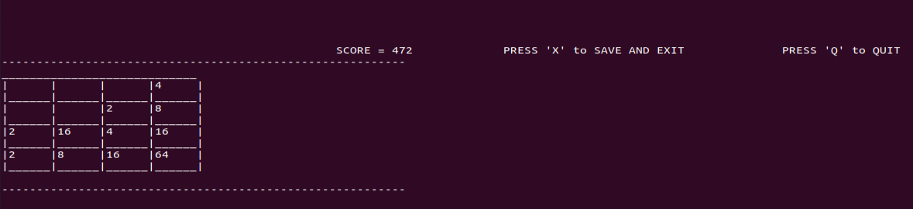

# 2048 - CLI based Multiplayer version
### :heavy_check_mark: Working

## Information
Terminal-based implementation of popular 2048 puzzle game. In this game, the player aims to create largest possible number using the basic numbers- 2 and 4, by following a bunch of addition rules.



## Instructions
- ```$ gcc 2048.c```
- ```$ ./a.out```
- Follow UI instructions and use the following numeric keys to perform moves:
   - ↑ (Press 8)
   - ↓ (Press 2)
   - →(Press 6)
   - ←(Press 4)
## Functionality
- Imitated standard rules and flow of classic 2048 game.
- **Additional features**: Multiplayer-support, High-score tracking support.
## Implementation 
- Entire implementation is done using standard C libraries; no UI libraries.

## Dependencies
- GCC
